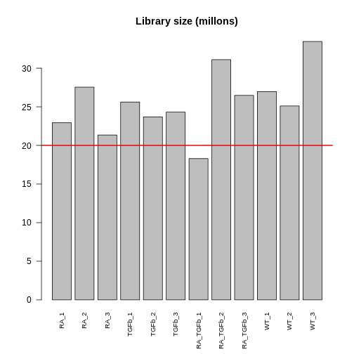
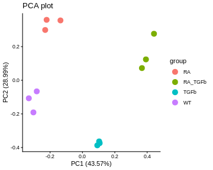
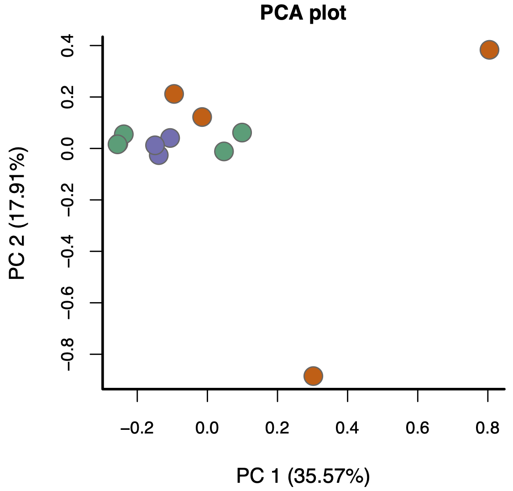

:::::::::::::::::::::::::::::::::::::: questions 

- Why should we filter out genes with little or no expression before differential expression analysis?
- What does “library size” mean, and why is it important to check?
- How can visualisation help us detect technical variation in RNA-seq data?
- What are the main sources of technical variation in RNA-seq experiments?
- How and why do we normalise RNA-seq data?
- What are CPM and TMM, and how do they help make samples comparable?
- How can we assess whether normalisation has worked correctly?

::::::::::::::::::::::::::::::::::::::::::::::::

::::::::::::::::::::::::::::::::::::: objectives

- Filter out lowly expressed genes to reduce noise and improve statistical power.
- Inspect and interpret library sizes to identify potential problems.
- Create and interpret PCA, boxplot, and RLE visualisations to assess technical variation.
- Explain the difference between biological and technical variation in RNA-seq data.
- Perform basic normalisation to correct for library size and compositional differences.
- Evaluate whether normalisation has successfully reduced unwanted technical variation.
- Recognise when batch effects or other confounding factors may require more advanced correction methods.

::::::::::::::::::::::::::::::::::::::::::::::::


## Filtering

So, assuming your counts table has biological replicates in each group (and any technical replicates have been taken care of), the first thing we need to do is *filtering*. More precisely, removing genes with little to no expression, because the former add "noise" while the latter aren't even relevant. There are various approaches to filtering, but one of the simplest is to use the `limma` function `filterByExpression`:

``` r
keep <- filterByExpr(dge, group=group) # logical vector indicating which rows of dge to keep
table(keep) # 32069 genes will be removed; 14009 genes will be kept
```

``` output
keep
FALSE  TRUE 
32069 14009 
```

``` r
dge <- dge[keep,,keep.lib.size=FALSE]
head(dge$counts) # compare to pre-filtered data to see the difference
```

``` output
   RA_1 RA_2 RA_3 TGFb_1 TGFb_2 TGFb_3 RA_TGFb_1 RA_TGFb_2 RA_TGFb_3 WT_1 WT_2
27   16   30   10     16     14     10        12        14        16    9   15
32  948 1158  880    940    880    943       656      1197       944 1123  967
33    9   21   19     12      4      6        17        17        18   12    9
34  609  711  577    752    688    647       476       837       688  717  709
36 1289 1617 1252   1427   1270   1216       993      1666      1440 1563 1445
44  873 1047  756   1110   1024   1009       819      1417      1144 1101  973
   WT_3
27   19
32 1375
33   24
34  846
36 1878
44 1347
```
Roughly speaking, this strategy keeps genes that have a reasonable number of counts in a worthwhile number samples, and removes them otherwise (see function help for precise details).

Following filtering, you should check the *library size* of each sample. The library size of a sample is simply the sum of the counts in that library, i.e.
$$
\begin{align*}
\text{Library size for sample}\ j &= \sum_{i} Y_{ij} \\
& = \sum_{\substack{\text{all genes}}} \text{counts for sample}\ j
\end{align*}
$$
where $Y_{ij}$ is the count for gene $i$ in sample $j$. Here's a plot of the library sizes for our data:

``` r
lib.size.millons <- colSums(dge$counts) / 1e6

barplot(lib.size.millons, las=2, cex.names=0.8, main="Library size (millons)")
abline(h=20, lwd=2, col="red2")
```



Library size is an important quantity. One reason to check it is because bigger is usually better: 5 million or less (not that good); 10-15 million (better); 20+ million (much better). This is because (1) it's a limited resource that needs to be "shared" between all the genes (in proportion to their expression); and (2) bigger counts generally means better statistical properties (e.g. power to detect DE). Another reason to check is because it will help signpost what tools you should use to analyse your data (more about this later).

## Visualisation

The next thing to do is *visualise* your data. This allows you to (1) see the landscape of biological differences between experimental groups, and (2) assess whether the data is affected by technical variation. Detecting technical variation is particularly important because its presence leads to missed and/or false discoveries, i.e. rubbish DE results. Thus, this step is crucial: analysing RNA-seq data without visualisation is literally "flying blind"!

There are many visualisation methods. Each has different advantages and show different aspects of the data---there is no single perfect visualisation, so use several! Here we'll discuss three: 

1. *PCA plots*. These give a special low dimensional representation of our (very) high dimensional data (i.e. where we've taken thousands of measurements on each sample). A ``good" plot looks like this: (1) replicates *cluster*; and (2) there's some *separation* of biological groups.

2. *Boxplots*. These are very simple: you take all the expression measurements in each sample and dump them into a boxplot, one boxplot for each sample. A ``good" set of plots looks like this: the boxplots are lined up, without much movement between them.

3. *RLE plots*. These are the same as boxplots but with one extra (crucial) step: subtracting the row median from each row before dumping the observations into boxplots. This additional step removes the between-gene variation, making the plot more sensitive than boxplots for detecting technical variation. A ``good" plot looks like this: the boxplot medians are lined up around zero and the boxes are roughly the same size.

If any of these plots don't look ``good", in the ways described, this indicates the presence of technical variation. 

Let's make each plot then discuss them:

``` r
# log transform counts, note: 1/2 offset to avoid log transforming zeros
y <- log2(dge$counts + 1/2)

# PCA plot (nice ggplot version, potentially for publication)
pca <- prcomp(t(y), center=TRUE) 
autoplot(pca, data.frame(group=group), col='group', size=4) + 
  theme_classic() +
  ggtitle("PCA plot")
```

``` warning
Warning: `aes_string()` was deprecated in ggplot2 3.0.0.
ℹ Please use tidy evaluation idioms with `aes()`.
ℹ See also `vignette("ggplot2-in-packages")` for more information.
ℹ The deprecated feature was likely used in the ggfortify package.
  Please report the issue at <https://github.com/sinhrks/ggfortify/issues>.
This warning is displayed once every 8 hours.
Call `lifecycle::last_lifecycle_warnings()` to see where this warning was
generated.
```



``` r
# boxplot and RLE plot (simple base R versions; they're generally not for publication)
par(mfcol=c(1,2))
cols.group <- group
levels(cols.group) <- hue_pal()(4)

boxplot(y, col=as.character(cols.group), outline=FALSE, las=2, cex.axis=0.6, main="Boxplots")

RLE <- y - rowMedians(y)
boxplot(RLE, col=as.character(cols.group), outline=FALSE, las=2, cex.axis=0.6, main="RLE plot")
abline(h=0, col="grey20", lwd=3, lty=1)
```


Note that we made these plots with log transformed counts, not the counts themselves (the reason for this is technical: the log transformation roughly removes the strong mean-variance relationship inherent in RNA-seq data, something we don't want driving our visualisations). 

For our data, the PCA plot looks okay; the replicates cluster reasonably well and there's separation of biological groups. The boxplots and RLE plot, on the other hand, tell a different story (which is why you should visualise your data multiple ways!). The boxplots are wobbling around a little, which is a problem. Indeed, the RLE plot reveals things are far from ideal. The boxplots and RLE plot clearly indicate the presence of technical variation which needs to be removed if we're to obtain non-rubbish results. This is the topic we turn to next.

## Basic normalisation

Unfortunately, when doing RNA-seq analysis we can't simply compare counts between samples because there's almost always technical differences between them. To make samples properly comparable, the data needs to be *normalised*: we need to remove or adjust for technical differences between samples, leaving only biological differences (the thing we're interested in!). Failing to successfully normalise your data can lead to significant missed and/or false discoveries (rubbish results).

Two important technical differences between samples are (1) library size differences and (2) compositional differences:

1. *Library size differences*. To see the problem here look at Gene 3 in the made up table of counts:


{width=70%}


Does Gene 3 show a biological or technical difference between the two groups? Looks like a biological difference, but what if I told you the library sizes for group B were 3 times bigger? In that case, the difference looks more like an artifact of library size rather than a true biological difference. Let's look at the problem another way:


{width=70%}


It should be clear from this that differences resulting from different library sizes can be mistaken for biological differences. One simple way to (roughly) normalise for library size differences is to calculate *counts-per-million (CPM)*. If we again let $Y_{ij}$ be the count for gene $i$ in sample $j$, and let $N_j$ be the library size for sample $j$, then the CPM value for gene $i$ in sample $j$ is given by
$$
\text{CPM}_{ij} = \frac{Y_{ij}}{N_j} \times 10^6 = \frac{\text{Count}}{\text{Library size}} \times 10^6,
$$
Because CPM values are (scaled) *proportions*, i.e. "Count / Library size", not absolute counts, the issue of library size differences is no longer relevant.

2. *Compositional differences*. For each sample, the probability of sequencing a transcript is proportional to its abundance---this is the basis of how RNA-seq works (of course!). To see the potential problem this fact creates, look at this figure:


{width=70%}


These two samples are the same (they have the same number of red, yellow, blue, and green transcripts) except for the black transcript: sample A has many more black transcripts. This difference in composition means that even if the library sizes are the same, comparing raw counts still gives the wrong impression. One popular approach for normalising out these differences is the `TMM` method (from the `edgeR` package).

Here's how to adjust for library size and compositional differences in our example:

``` r
dge <- calcNormFactors(dge, method="TMM") # adjustment factors for composition; stored in our container for later use
CPM <- cpm(dge) # adjustment factors for composition incorporated when calculating cpm values
head(CPM) # compare to the raw counts
```

``` output
     RA_1  RA_2   RA_3 TGFb_1 TGFb_2 TGFb_3 RA_TGFb_1 RA_TGFb_2 RA_TGFb_3
27  0.728  1.13  0.476  0.613  0.576   0.40     0.635     0.439     0.589
32 43.136 43.55 41.866 36.001 36.189  37.76    34.720    37.554    34.726
33  0.410  0.79  0.904  0.460  0.164   0.24     0.900     0.533     0.662
34 27.711 26.74 27.451 28.801 28.293  25.91    25.193    26.260    25.309
36 58.652 60.81 59.564 54.652 52.227  48.69    52.556    52.268    52.973
44 39.723 39.37 35.967 42.512 42.111  40.40    43.347    44.456    42.084
     WT_1   WT_2   WT_3
27  0.338  0.610  0.583
32 42.181 39.339 42.220
33  0.451  0.366  0.737
34 26.931 28.843 25.977
36 58.707 58.785 57.665
44 41.354 39.583 41.360
```

Before we can proceed, however, we need to do something *very important*: we need to *check* that the normalisation methodology we've applied has actually worked! One way of doing this is through visualisation. You want to see that the normalisation has (1) removed technical (unwanted) variation, while (2) retaining (i.e. not removing) the biological differences of interest. For example, here's what our data looks like after normalising for library size and composition:

``` r
# log transform adjusted CPM values
y <- cpm(dge, log=TRUE)

# PCA plot (nice ggplot version, potentially for publication)
pca <- prcomp(t(y), center=TRUE) 
autoplot(pca, data.frame(group=group), col='group', size=4) + 
  theme_classic() +
  ggtitle("PCA plot")
```


``` r
# boxplot and RLE plot (simple base R versions; they're generally not for publication)
par(mfcol=c(1,2))
cols.group <- group
levels(cols.group) <- hue_pal()(4)

boxplot(y, col=as.character(cols.group), outline=FALSE, las=2, cex.axis=0.6, main="Boxplots")

RLE <- y - rowMedians(y)
boxplot(RLE, col=as.character(cols.group), outline=FALSE, las=2, cex.axis=0.6, main="RLE plot")
abline(h=0, col="grey20", lwd=3, lty=1)
```


Note that we can now use the cpm function to calculate logged data. The PCA plot looks better: the replicates are clustered more tightly (technical variation has been removed), and the biological groups are more separated (biological differences between groups are maintained, actually improved). Moreover, the boxplots and RLE plot are looking much better: the boxplots are lined up, and the RLE plot medians are centered on zero and the boxes are roughly similar in size.

WARNING!...library size and composition differences aren’t the only kinds of technical differences that can arise between samples:

- Another way they can arise is when different samples are prepared differently, e.g.

  - with different protocols, or
  - in different labs, or
  - on different dates, or
  - by different people, or
  - etc.


  
  These differences can lead to so-called "batch effects". For example, consider these PCA plots of a real data set:


{width=80%}


These are both the "same" PCA plot, but one is coloured by biological condition and the other is coloured by batch. The major factor driving separation (along PC1) is batch, not biological condition; consequently, replicates are not clustering by group, and the groups aren't separating. Batch effects like these can only be corrected with more sophisticated analysis approaches, a topic outside the scope of this workshop. 

- Moreover, batch effects aren't the only way problems can arise (beyond library size and composition). For example, consider this PCA plot of another real data set (coloured by biological condition):


{width=40%}


Again, the replicates aren't really clustering and the groups aren't really separating. The problem here, however, isn't batch effects---it's something much more subtle.

The bottom line is this: if, after normalising for library size and composition, your visualisations don't look reasonably "good", in the ways discussed above, the results you'll get from proceeding with a DE analysis will likely contain missed and/or false discoveries---you'll likely get rubbish results.


:::::::::::::::::::::::::::::::::::::: keypoints

- Filtering lowly expressed genes improves signal-to-noise and reliability of DE results.
- Library size influences count comparisons; larger libraries generally provide more statistical power.
- Visualisation (PCA, boxplots, RLE) is essential to detect technical variation and assess data quality.
- Log transformation of counts stabilises variance and makes visual patterns easier to interpret.
- Normalisation corrects for library size and compositional biases, allowing fair comparison across samples.
- TMM (trimmed mean of M-values) is a common method for normalising RNA-seq data using edgeR.
- Good normalisation removes unwanted technical variation while preserving biological signal.
- Persistent technical effects (e.g. batch effects) require more advanced correction strategies beyond basic normalisation.

::::::::::::::::::::::::::::::::::::::
