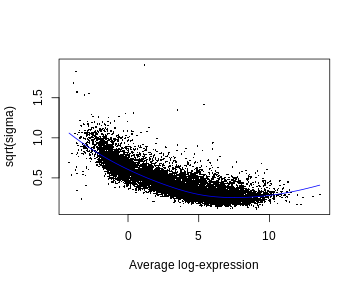
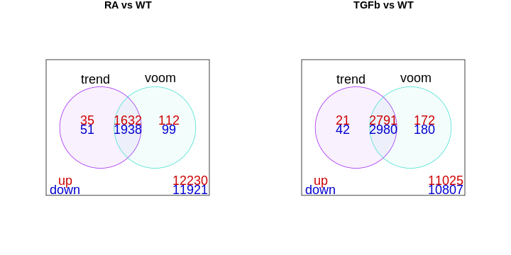

:::::::::::::::::::::::::::::::::::::: questions 

- How does the limma method identify differentially expressed genes?
- Why are linear models used to analyse RNA-seq data?
- What role does empirical Bayes moderation play in improving DE analysis?
- How can we assess whether DE results are trustworthy?
- What is the difference between the limma-trend and limma-voom approaches?

::::::::::::::::::::::::::::::::::::::::::::::::

::::::::::::::::::::::::::::::::::::: objectives

- Understand how RNA-seq data can be modelled using linear models in limma.
- Perform DE testing using moderated t-statistics and empirical Bayes.
- Interpret log-fold-changes, p-values, and adjusted p-values (FDR).
- Evaluate DE results with diagnostic plots (SA, MD, p-value histograms).
- Compare and choose between the limma-trend and limma-voom approaches.

::::::::::::::::::::::::::::::::::::::::::::::::


## Statistical model (for the data)

Let's remind ourselves of our goal. Look again at the made up table of counts:


{width=80%}


We want to answer the question: which genes are DE, i.e. have significantly different levels of expression between groups? For example, does Gene 3 have higher expression in group B? It looks like it does (assuming there's no library size and composition difference), but there’s also *variation*. Thus, we need to do some statistics! And for this we're going to need a *statistical model* for the data. Let $Y_{ij}$ be the count for gene $i$ in sample $j$:


{width=30%}


For various reasons (theoretical and empirical), it turns out that a good model for RNA-seq count data (on biological replicates) is the *Negative Binomial* (NB) distribution:
$$
Y_{ij} \sim \text{Negative Bionomial}
$$
You might have never even heard of this obscure distribution! Remarkably, however, it can shown that log transformed NB count data (or adjusted CPM data) follows, to good approximation, a simple *Normal* distribution:
$$
\log(Y_{ij}) \sim \text{Normal}
$$
With this in mind, we can distinguish the two main approaches to DE analysis:

1. Analyse the counts directly
    - Popular methods are: `edgeR` and `DEseq2`
    - These use the NB distribution and generalised linear models (GLMs)
    - Roughly speaking, these are applicable in all situations (in contrast to recommendations below)
<br>
<br>
2. Analyse log transformed expression values (more precisely: log transformed adjusted CPM values)
    - The most popular method is `limma`, which comes in two flavours: `limma-trend` and `limma-voom`
    - These use the normal distribution and simple linear models (LMs).
    - Recommendations
      - Neither flavour is recommended when library sizes are very small (e.g. less than 1M) [or more generally: when the average counts per feature is small]
      - `limma-voom` in particular is recommended when library sizes are very different (e.g. some libraries have size 2M while others have size 20M).
    
Since the library sizes aren't too small in our example, we'll focus on the `limma` approach, and since the library sizes aren't too different, we'll focus initially on `limma-trend` and return to a discussion of `limma-voom` later. While methods that analyse counts directly are more generally applicable, they're more difficult to understand conceptually and to apply. Thankfully, however, the log transformation approach (`limma`) is applicable to most RNA-seq data sets.

The first step in our analysis will be to create another container, called an `EList`, which will store our log transformed (adjusted) CPM values and gene annotation:

``` r
y <- new("EList")
y$E <- cpm(dge, log=TRUE, prior.count=1/2)
y$genes <- dge$genes
```

## Linear model (for the means)

Now that we've decided on a model for the data, and corresponding methodology, we need to connect the data to the *means* for each experimental group. For this, we use a *linear model*. There's many ways to talk about and apply linear models---we'll do it the simplest way possible.

Take any gene, and let $y_1, y_2, \ldots, y_{12}$ be the 12 log expression observations for that gene. Now let $y_{1,RA}, y_{2,RA}, y_{3,RA}$ be the three observations for the RA group specifically. We can write
$$
\begin{align}
y_{1,RA} &= \mu_{RA} + \epsilon_1 \\
y_{2,RA} &= \mu_{RA} + \epsilon_2 \\
y_{3,RA} &= \mu_{RA} + \epsilon_3,
\end{align}
$$
where $\mu_{RA}$ is the RA group mean and the $\epsilon$'s are random errors (i.e. biological variation!). Note that all three observations share the group mean $\mu_{RA}$; they differ only because of the random errors. 

Similarly, we can do this for all 12 observations:
$$
\begin{align}
y_{1,RA} &= \mu_{RA} + \epsilon_1 \\
y_{2,RA} &= \mu_{RA} + \epsilon_2 \\
y_{3,RA} &= \mu_{RA} + \epsilon_3 \\
y_{4,TGFb} &= \mu_{TGFb} + \epsilon_4 \\
y_{5,TGFb} &= \mu_{TGFb} + \epsilon_5 \\
y_{6,TGFb} &= \mu_{TGFb} + \epsilon_6 \\
y_{7,RA\_TGFb} &= \mu_{RA\_TGFb} + \epsilon_7 \\
y_{8,RA\_TGFb} &= \mu_{RA\_TGFb} + \epsilon_8 \\
y_{9,RA\_TGFb} &= \mu_{RA\_TGFb} + \epsilon_9 \\
y_{10,WT} &= \mu_{WT} + \epsilon_{10} \\
y_{11,WT} &= \mu_{WT} + \epsilon_{11} \\
y_{12,WT} &= \mu_{WT} + \epsilon_{12}.
\end{align}
$$
Now, using some simple high-school matrix-vector notation and algebra, we can write
$$
\begin{bmatrix}  
y_{1,RA} \\ 
y_{2,RA} \\ 
y_{3,RA} \\ 
y_{4,TGFb} \\ 
y_{5,TGFb} \\ 
y_{6,TGFb} \\ 
y_{7,RA\_TGFb} \\ 
y_{8,RA\_TGFb} \\ 
y_{9,RA\_TGFb} \\ 
y_{10,WT} \\ 
y_{11,WT} \\ 
y_{12,WT}
\end{bmatrix}
\quad
=
\quad
\begin{bmatrix}
\mu_{RA} + \epsilon_1 \\
\mu_{RA} + \epsilon_2 \\
\mu_{RA} + \epsilon_3 \\
\mu_{TGFb} + \epsilon_4 \\
\mu_{TGFb} + \epsilon_5 \\
\mu_{TGFb} + \epsilon_6 \\
\mu_{RA\_TGFb} + \epsilon_7 \\
\mu_{RA\_TGFb} + \epsilon_8 \\
\mu_{RA\_TGFb} + \epsilon_9 \\
\mu_{WT} + \epsilon_{10} \\
\mu_{WT} + \epsilon_{11} \\
\mu_{WT} + \epsilon_{12}
\end{bmatrix}
\quad
= 
\quad
\begin{bmatrix} 
1 & 0 & 0 & 0 \\
1 & 0 & 0 & 0 \\
1 & 0 & 0 & 0 \\
0 & 0 & 1 & 0 \\
0 & 0 & 1 & 0 \\
0 & 0 & 1 & 0 \\
0 & 1 & 0 & 0 \\
0 & 1 & 0 & 0 \\
0 & 1 & 0 & 0 \\
0 & 0 & 0 & 1 \\
0 & 0 & 0 & 1 \\
0 & 0 & 0 & 1
\end{bmatrix}
\begin{bmatrix}
\mu_{RA}\\
\mu_{RA\_TGFb}\\
\mu_{TGFb}\\
\mu_{WT}
\end{bmatrix}
\quad
+
\quad
\begin{bmatrix}
\epsilon_1 \\
\epsilon_2 \\
\epsilon_3 \\
\epsilon_4 \\
\epsilon_5 \\
\epsilon_6 \\
\epsilon_7 \\
\epsilon_8 \\
\epsilon_9 \\
\epsilon_{10} \\
\epsilon_{11} \\
\epsilon_{12}
\end{bmatrix}
$$
or, more compactly: $\mathbf{y} = \mathbf{X} \boldsymbol\beta + \boldsymbol\epsilon$. This is the linear model for our data, and we'll use the following terminology:

  - $\mathbf{X}$ is called the "design" matrix
  - $\boldsymbol\beta$ is called the vector of coefficients

We'll fit this (one) model to every gene, which amounts to *estimating* the coefficient vector $\boldsymbol\beta$ for each gene, i.e. the group means for every gene!

While the terminology above is important to know, don't worry if you didn't follow all the details of the discussion. The details are there partly for completeness, but mostly to help demystify design matrices: they're just something that connects your data (observed expression values) to the things of interest, in our case the means of the groups. The design matrix is easy to make using our `group` factor vector:

``` r
X <- model.matrix(~0 + group) # note the "0": VERY important!
colnames(X) <- levels(group)
X
```

``` output
   RA RA_TGFb TGFb WT
1   1       0    0  0
2   1       0    0  0
3   1       0    0  0
4   0       0    1  0
5   0       0    1  0
6   0       0    1  0
7   0       1    0  0
8   0       1    0  0
9   0       1    0  0
10  0       0    0  1
11  0       0    0  1
12  0       0    0  1
attr(,"assign")
[1] 1 1 1 1
attr(,"contrasts")
attr(,"contrasts")$group
[1] "contr.treatment"
```
Observe, of course, that this is the same as the design matrix above. Fitting the linear model is easy too:

``` r
fit <- lmFit(y, design=X)
names(fit)
```

``` output
 [1] "coefficients"     "rank"             "assign"           "qr"              
 [5] "df.residual"      "sigma"            "cov.coefficients" "stdev.unscaled"  
 [9] "pivot"            "genes"            "Amean"            "method"          
[13] "design"          
```

``` r
head(fit$coefficients)
```

``` output
       RA RA_TGFb   TGFb     WT
27 -0.412  -0.818 -0.887 -0.960
32  5.422   5.156  5.196  5.366
33 -0.547  -0.510 -1.816 -0.955
34  4.772   4.678  4.790  4.768
36  5.899   5.717  5.695  5.868
44  5.261   5.436  5.381  5.350
```
We've arrived at the group means for each gene, but this isn't what we're really after: what we really want are differences between the group means---remember: we're looking for DE genes---or, more precisely, we want *differences* between the group means for *contrasts* (i.e. comparisons) of interest. To do this, we construct the contrasts of interest and then fit them. For example, suppose we're interested in two comparisons: (1) RA vs WT (i.e. the effect of RA), and (2) TGFb vs WT (i.e. the effect of TGFb). The corresponding contrast (matrix) is constructed as follows:

``` r
CM <- makeContrasts(
  RA_WT   = RA - WT,
  TGFb_WT = TGFb - WT,
  levels=X)
CM
```

``` output
         Contrasts
Levels    RA_WT TGFb_WT
  RA          1       0
  RA_TGFb     0       0
  TGFb        0       1
  WT         -1      -1
```
Now, to calculate these contrasts, i.e. to fit them, we do the following:

``` r
fit2 <- contrasts.fit(fit, contrasts=CM)
head(fit2$coefficients)
```

``` output
    Contrasts
       RA_WT TGFb_WT
  27  0.5487  0.0731
  32  0.0556 -0.1699
  33  0.4082 -0.8608
  34  0.0038  0.0217
  36  0.0314 -0.1726
  44 -0.0891  0.0317
```
This has transformed the initial coefficients (i.e. groups means) into the contrasts of interest: the difference in means between the RA and WT groups (column 1) and the difference in means between the TGFb and WT groups (column 2).

## Testing for DE

Now that we have our differences in group means for each gene, we want to ask if any of these differences are *significantly different from zero* (over and above what you might see by random chance). In other words, for each gene we want to statistically test if the means of the two groups are different---more simply: we want to test for DE! To do this, we'll use the so-called t-test (applied to each gene), whose test statistic looks like this:
$$
T = \frac{\bar{y}_{_{A}} - \bar{y}_{_{B}}}{ \sqrt{v}}
$$
where $\bar{y}_{_{A}}$ and $\bar{y}_{_{B}}$ are the means of the two groups being compared, and $v$ is an estimate of the variance. To test the null hypothesis (that the means are the same), we use the $t$-distribution to calculate probabilities about this test statistic (if the chances of seeing certain values of $T$ are small, this is evidence against the null hypothesis that the group means are the same).

At this point you must be thinking: "why did we do all that linear models stuff if, in the end, we're just going to use a t-test?" There are at least two reasons. Briefly:

1. By using a linear model we've actually used *all* the samples to estimate the variability $v$ here (a standard t-test would only estimate it from the two groups being compared) and so the estimate is better.
2. Linear models are much more powerful than our simple situation suggests: they can be used to easily adjust for things which aren't of interest but affect the things of interest, e.g. you can make comparisons while adjusting for biological things (e.g. sex) or while adjusting for technical things (e.g. batch), or while adjusting for both!

Hopefully this convinces you that linear models are your friend, but now you must be thinking a different question: "wait a second...we're going to do t-tests with as little as 2 or 3 observations in each group?...that's crazy!" Yes, that does seem crazy---there's barely any information in each group to make a reliable inference about whether the means are different. But this is where the real magic of RNA-seq analysis comes in, the thing that makes it all work: *empirical Bayes* statistics. The full details are beyond the scope of our discussion, but the rough idea is this: we use a procedure whereby the genes are allowed to *share information* with each other---this sharing of information between genes makes up for the fact that there isn't much information within any single gene. This procedure is applied to the gene variances---the $v$'s above---which *moderates* them, making them better estimates, and thus increasing our power to detect DE (other terms for this 'moderation' procedure include 'shrinkage' or 'regularization', terms which you may see in your travels---this powerful technique is used in many places in statistical omics analysis). So, the statistic used to test for DE is actually
$$
\widetilde{T} = \frac{\bar{y}_{_{A}} - \bar{y}_{_{B}}}{ \sqrt{ \widetilde{v} }}
$$
where $\widetilde{v}$ is the moderated variance; accordingly, $\widetilde{T}$ is called the "moderated t-statistic".

That said, testing for DE with the moderated t-statistic is actually easy:

``` r
fit2 <- eBayes(fit2, trend=TRUE) # "eBayes" means empirical Bayes
names(fit2) # note the addition of "t" (and other empirical Bayes things, which needn't concern us)
```

``` output
 [1] "coefficients"     "rank"             "assign"           "qr"              
 [5] "df.residual"      "sigma"            "cov.coefficients" "stdev.unscaled"  
 [9] "pivot"            "genes"            "Amean"            "method"          
[13] "design"           "contrasts"        "df.prior"         "s2.prior"        
[17] "var.prior"        "proportion"       "s2.post"          "t"               
[21] "df.total"         "p.value"          "lods"             "F"               
[25] "F.p.value"       
```
NOTE. We've specified the function option `trend=TRUE` (this isn't default). This is because one characteristic of RNA-seq data is that there is a downward trend in variability as a function of the level of expression---genes with lower levels of expression are more variable than genes with higher levels of expression (see next section). The empirical Bayes procedure takes this trend into account.

There's a fair amount of differential expression---here's the number of DE genes for each comparison:

``` r
dt <- decideTests(fit2)
summary(dt)
```

``` output
       RA_WT TGFb_WT
Down    1989    3022
NotSig 10353    8175
Up      1667    2812
```

## Some checks

Before we look at the DE results more closely, there's some things we need to check:

1. *SA plot*. This is a plot of variability (estimated by the linear model) as a function of expression level. It typically has a characteristic shape: it (monotonically) trends downward.
2. *MD plot (for each comparison)*. This is simply a plot of log-fold-change (y-axis) and expression level (x-axis) for all genes. The meaning of 'log-fold-change' will be discussed below. For now, we note that these plots should look as follows: (1) the 'cloud' of data is skewered through the middle, (2) the red/blue dots are on top/bottom, respectively, and in roughly the same proportions (unless you have a reason to think otherwise), and (3) there's a characteristic funnel shape, thicker to thinner as expression level increases. 
3. *p-value histogram (for each comparison)*. This is simply a histogram of all the DE hypothesis test p-values (one p-value for each gene). It should look like this: flat, with a possible spike on the far left. The intuitive idea here is simple: a large majority of genes aren't DE, i.e. the null hypothesis is true for then, and so testing them for DE should just produce p-values that are random noise between 0-1, and thus a the histogram of these p-values should be flat; the possible spike to the far left are p-values from genes which are truly DE.

These are made as follows:

``` r
plotSA(fit2)
```



``` r
par(mfcol=c(1,2))
plotMD(fit2, coef="RA_WT", status=dt[,"RA_WT"], cex=0.6, main="MD-plot: RA vs WT")
abline(h=0, lwd=2, col="green2")
plotMD(fit2, coef="TGFb_WT", status=dt[,"TGFb_WT"], cex=0.6, main="MD-plot: TGFb vs WT")
abline(h=0, lwd=2, col="green2")
```


``` r
par(mfcol=c(1,2))
hist(fit2$p.value[,"RA_WT"], col="grey", xlab="p-value", main="p-value histogram: RA vs WT")
hist(fit2$p.value[,"TGFb_WT"], col="grey", xlab="p-value", main="p-value histogram: TGFb vs WT")
```


These visualisations look as they should in this case. However, if you produce plots that don't look reasonably close to these, then something isn't right. Depending on how bad they look, the results will likely contain missed and/or false discoveries---they'll be rubbish. The p-value histograms are particularly important. Consider two real examples from different data sets below:


{width=80%}


The plot on the right is ideal, i.e. flat with possible spike to the left. The plot on the left is far from ideal. If you produce a plot that looks like this, your results are likely rubbish!

## Results

With these checks done, we're now ready to look at the results. Here's results for the top genes from each comparison:

``` r
tab1 <- topTable(fit2, coef="RA_WT", n=Inf)
tab2 <- topTable(fit2, coef="TGFb_WT", n=Inf)

# RA vs WT
head(tab1)
```

``` output
               EnsemblID Symbol logFC AveExpr    t  P.Value adj.P.Val    B
16476 ENSMUSG00000023961  Enpp4  3.37    5.25 48.6 3.76e-16  3.07e-12 25.5
41476 ENSMUSG00000029530   Ccr9  7.79    6.47 48.1 4.39e-16  3.07e-12 25.4
41478 ENSMUSG00000025245 Lztfl1  5.06    6.21 46.2 7.33e-16  3.42e-12 25.1
18334 ENSMUSG00000039982   Dtx4  2.88    6.25 42.8 1.98e-15  6.93e-12 24.4
30887 ENSMUSG00000029468  P2rx7  8.25    4.81 40.4 4.14e-15  1.16e-11 23.9
29165 ENSMUSG00000029093 Sorcs2  8.48    2.12 36.9 1.37e-14  3.19e-11 23.0
```

``` r
# TGFb vs WT
head(tab2)
```

``` output
               EnsemblID  Symbol logFC AveExpr    t  P.Value adj.P.Val    B
17757 ENSMUSG00000024544 Ldlrad4  3.87    5.29 49.1 3.34e-16  4.68e-12 26.4
22483 ENSMUSG00000038400  Pmepa1  2.91    5.11 40.5 4.05e-15  2.84e-11 24.4
6625  ENSMUSG00000020841     Cpd  5.00    4.86 37.6 1.05e-14  4.90e-11 23.7
9268  ENSMUSG00000095079    Igha  8.04    4.88 35.7 2.06e-14  7.13e-11 23.1
14875 ENSMUSG00000022657    Cd96  1.59    8.21 35.1 2.54e-14  7.13e-11 22.9
14967 ENSMUSG00000047293   Gpr15  6.24    1.43 34.5 3.19e-14  7.44e-11 22.7
```
Let's interpret these results (note: we'll ignore the "B" column):

1. *Symbol*. These are simply gene symbols.
3. *AveExpr*. The average level of expression for that gene (taken across all samples).
2. *logFC*, i.e. log-fold-change. This is important, but sometimes misunderstood. Here it means the difference between the group means, or more specifically: for the first table logFC = RA group mean - WT group mean; for the second table logFC = TGFb group mean - WT group mean. The reason for the "log" bit in "log-fold-change" is because the means are calculated on a log-scale; the reason for the "fold-change" bit in "log-fold-change" is because a difference of logs is the log of the ratio.
4. *t*. The moderated t-statistic.
5. *P.Value*. The p-value for the hypothesis test of DE obtained using the moderated t-statistic (NOTE: this is typically ignored--see below).
6. *adj.P.Val*. The p-value adjusted for 'multiple testing' (typically using the Benjamini-Hochberg method). Usually a gene is inferred/judged to be DE only if adj.P.Val < 0.05.

The distinction between (5) and (6) is particularly important, so let's say more. Firstly, in our context, we're doing ~10,000 hypothesis tests, and so the idea of a p-value isn't particularly useful. To appreciate this, consider the following [xkcd](https://xkcd.com/) comic:


{width=60%}


Recall that the p-value is the probability of seeing certain values of our test statistic, assuming the null hypothesis is true, and that we reject the null assumption if the calculated probability is small, say, below 0.05. But, this implies the following: if we were testing 10,000 genes, and the null hypothesis was true for every gene (i.e. there was no DE in the data set), then we'd still reject the null (i.e. infer DE) for ~500 genes---that's 500 false discoveries! The solution to this problem is to focus on a different idea: the *false discovery rate* (FDR). This is the proportion of false discoveries of DE amongst all the genes you've declared to be DE. This is what the adjusted p-value (adj.P.Val) represents, i.e. if you choose a DE cutoff of adj.P.Val < 0.05 then only 5% of the genes declared DE with this cutoff will be false discoveries.

At this point, one extra way of checking your results is to look at any known *control genes* relevant to the experiment: *positive* or *negative* controls, i.e. genes which *should* or *shouldn't* be DE between conditions, respectively. For example, a *positive* control for this experiment is Hic1 because RA is known to up-regulate this gene---it should be DE in the RA vs WT comparison, and indeed it is:

``` r
i <- tab1$Symbol=="Hic1"
tab1[i,]
```

``` output
              EnsemblID Symbol logFC AveExpr  t  P.Value adj.P.Val    B
6572 ENSMUSG00000043099   Hic1  4.84    4.79 32 8.57e-14   1.5e-10 21.5
```
If it turned out this gene wasn't DE, this would cast some doubt over the validity of the analysis.

Finally, let's save our results in an Excel spreadsheet!:

``` r
write.xlsx(tab1, file="../Results/DE_RA-vs-WT.xlsx")
```

``` warning
Warning in file.create(to[okay]): cannot create file
'../Results/DE_RA-vs-WT.xlsx', reason 'No such file or directory'
```

``` r
write.xlsx(tab2, file="../Results/DE_TGFb-vs-WT.xlsx")
```

``` warning
Warning in file.create(to[okay]): cannot create file
'../Results/DE_TGFb-vs-WT.xlsx', reason 'No such file or directory'
```

## Two limma approaches: "trend" vs "voom"

Recall that there's two flavours of `limma`: `trend` and `voom`. We've been using the `trend` approach, but now we'll briefly turn to the `voom` approach. Both approaches are essentially the same, except for one key difference: `voom` first estimates "precision weights" (the details are beyond our scope) and incorporates them into the linear modelling step.

Given you now know the `trend` approach, the `voom` approach is easy to summarise. We do all the same steps above, right up until before we create an `EList`, at which point we proceed as follows:

``` r
# prepare a voom EList, containing "precision weights" from our DGEList and the same design X above
v <- voom(dge, design=X, plot=FALSE)

# fit linear model (to get group means); "precision weights" will be incorporated
fit.voom <- lmFit(v, design=X)

# fit contrasts using the same contrast matrix CM (for the relevant comparisons)
fit2.voom <- contrasts.fit(fit.voom, contrasts=CM)

# test for DE using empirical Bayes moderated t-statistics
fit2.voom <- eBayes(fit2.voom, trend=FALSE) # NOTE: trend=FALSE (see comments below)

# DE summary and results
dt <- decideTests(fit2.voom)
summary(dt)
```

``` output
       RA_WT TGFb_WT
Down    2037    3160
NotSig 10228    7886
Up      1744    2963
```

``` r
# top DE genes
topTable(fit2.voom, coef="RA_WT")
```

``` output
               EnsemblID        Symbol logFC AveExpr     t  P.Value adj.P.Val
16476 ENSMUSG00000023961         Enpp4  3.37    5.25  43.0 9.58e-16  1.10e-11
18334 ENSMUSG00000039982          Dtx4  2.88    6.25  41.4 1.57e-15  1.10e-11
3877  ENSMUSG00000089672         Gp49a  3.46    6.60  37.5 5.89e-15  2.06e-11
41478 ENSMUSG00000025245        Lztfl1  5.07    6.21  37.9 5.08e-15  2.06e-11
3878  ENSMUSG00000062593        Lilrb4  3.49    6.00  34.5 1.82e-14  5.11e-11
41476 ENSMUSG00000029530          Ccr9  7.77    6.47  32.3 4.34e-14  1.01e-10
2169  ENSMUSG00000051998          Lax1 -1.42    7.09 -27.1 4.42e-13  6.88e-10
970   ENSMUSG00000026009          Icos -1.62    6.91 -26.8 5.02e-13  7.03e-10
8904  ENSMUSG00000021185 9030617O03Rik -4.14    3.36 -30.4 9.45e-14  1.66e-10
30887 ENSMUSG00000029468         P2rx7  8.23    4.81  31.0 7.52e-14  1.51e-10
         B
16476 25.8
18334 25.6
3877  24.7
41478 24.5
3878  23.6
41476 21.5
2169  20.5
970   20.4
8904  20.2
30887 20.1
```

``` r
topTable(fit2.voom, coef="TGFb_WT")
```

``` output
               EnsemblID  Symbol logFC AveExpr     t  P.Value adj.P.Val    B
17757 ENSMUSG00000024544 Ldlrad4  3.87    5.29  50.5 1.14e-16  1.59e-12 27.4
14968 ENSMUSG00000022744  Cldnd1  2.39    5.01  35.3 1.34e-14  4.71e-11 23.9
22483 ENSMUSG00000038400  Pmepa1  2.90    5.11  35.4 1.26e-14  4.71e-11 23.8
6625  ENSMUSG00000020841     Cpd  5.00    4.86  37.4 6.05e-15  4.23e-11 23.8
14875 ENSMUSG00000022657    Cd96  1.59    8.21  34.6 1.76e-14  4.92e-11 23.7
23037 ENSMUSG00000027660    Skil  1.93    7.30  32.0 4.93e-14  1.15e-10 22.7
40680 ENSMUSG00000032420    Nt5e  2.13    7.16  30.9 7.71e-14  1.54e-10 22.3
601   ENSMUSG00000048234  Rnf149  1.79    5.33  30.2 1.04e-13  1.81e-10 21.9
40268 ENSMUSG00000032402   Smad3 -1.76    5.76 -29.7 1.30e-13  2.02e-10 21.7
1145  ENSMUSG00000026192    Atic -1.04    6.40 -27.1 4.30e-13  6.02e-10 20.5
```
The results have the same interpretations as before, and we can also do the same checks as before (i.e. MD plots, p-value histograms, control genes) except that instead of checking an SA plot, we check the voom 'mean-variance' trend plot produced automatically when `plot=TRUE` is specified in the voom function.

Two important comments:

1. We specified `trend=FALSE` in the `eBayes` DE testing step. This is because the voom "precision weights" actually remove the trend in variability noted earlier, and so this step doesn't need to use the 'trend' anymore.
2. `voom` is recommended when the library sizes are very different (e.g. some libraries have size 2M while others have size 20M) because the "precision weights" are able to take these differences in library sizes into account.

The library sizes aren't very different in our example and so both `limma` approaches give essentially the same DE genes, as can be seen here:

``` r
# DE results
dt.trend <- decideTests(fit2)
dt.voom <- decideTests(fit2.voom)

# venn diagram comparisons
df1 <- cbind(dt.trend[,"RA_WT"], dt.voom[,"RA_WT"])
df2 <- cbind(dt.trend[,"TGFb_WT"], dt.voom[,"TGFb_WT"])

par(mfcol=c(1,2))

vennDiagram(df1,
            main="RA vs WT",
            names=c("trend","voom"),
            include=c("up","down"), 
            counts.col=c("red3","blue3"), 
            circle.col=c("purple","turquoise"))

vennDiagram(df2,
            main="TGFb vs WT",
            names=c("trend","voom"),
            include=c("up","down"), 
            counts.col=c("red3","blue3"), 
            circle.col=c("purple","turquoise"))
```




:::::::::::::::::::::::::::::::::::::: keypoints

- RNA-seq data can be modelled with linear models after log transformation.
- The limma workflow estimates group means and contrasts, then tests for DE.
- Empirical Bayes moderation stabilises variances, improving reliability.
- Adjusted p-values (FDR) control false discoveries across many tests.
- limma-trend and limma-voom give similar results unless library sizes differ greatly.

::::::::::::::::::::::::::::::::::::::
