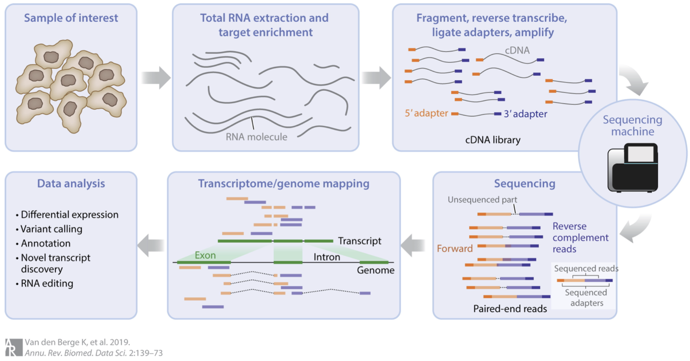
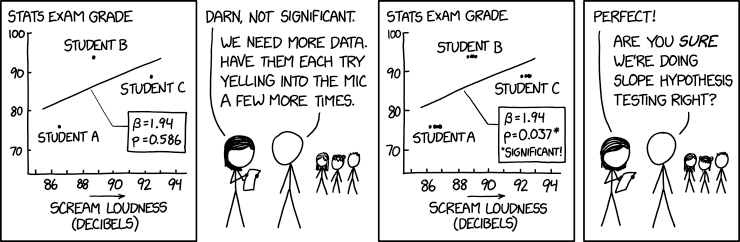

:::::::::::::::::::::::::::::::::::::: questions 

- FIXME

::::::::::::::::::::::::::::::::::::::::::::::::

::::::::::::::::::::::::::::::::::::: objectives

- FIXME

::::::::::::::::::::::::::::::::::::::::::::::::

```{r, echo=FALSE}
options(digits=3)
```

## Introduction

Comparing gene expression, i.e. the amount of RNA transcript, in different experimental conditions provides important biological insights. For example, comparing gene expression in cancer and non-cancer tissue gives us insights into the biology of cancer. While there are many ways of measuring gene expression, the focus of this workshop will be (bulk) *RNA-seq*, a technology which (nominally) measures gene expression across the whole transcriptome, i.e. *all* RNA transcripts, in a sample.

The main aim of this workshop is to show you how to go from a "counts table" of RNA-seq data to a ranked list of differentially expressed (DE) genes using R and statistical software packages from Bioconductor (note: basic knowledge of R will be assumed). This aim may seem modest, but our approach will be to carefully discuss each step along the way. The motivation for this is twofold: (1) to give you some understanding and thus confidence in what you're doing; and (2) to give you some skills to judge whether the DE results you obtain are likely to be trustworthy or rubbish.

The second motivation is important. In our context, rubbish DE results take two forms: *missed discoveries* (i.e. failing to infer a gene to be DE when it really is DE) or *false discoveries* (i.e. inferring a gene to be DE when it's actually not DE). Rubbish results are a real danger in the following way: you can competently do all the steps in this workshop and still arrive at rubbish! How is this possible? Because some data sets aren't amenable to the kinds of analyses we'll be discussing, and it's important to know when this occurs (if you care about the results!). Such data sets are typically problematic or difficult in some way and will require techniques and strategies beyond those contained in this workshop to obtain non-rubbish results. The good news, however, is that many data sets are amenable to the analyses we'll discuss.

*Important note*. Our starting point for RNA-seq analysis will be a `table of counts'; we won't begin from raw sequencing data (in the form of .fastq files). There's several reasons for this. Firstly, going from raw sequencing data to a table of counts can be computationally intensive and a little involved. Secondly, because of this, workshops often fail to spend enough time on the (more important) statistical part that comes after this, i.e. analysing the table of counts. Thirdly, many people have no interest in processing raw sequencing data; they're simply interested in analysing one of vast number of publicly available counts tables of RNA-seq data. If you've generated raw sequencing data of your own (or want to look at publicly available raw sequencing files) then you should look at other workshops for how to go from this data to a table of counts. But, if you've got a table of counts that you want to analyse, then this is the workshop for you!

## Some background

RNA-seq involves several steps, as summarised in this figure:


{width=90%}


We could say a lot more about each step, but this isn't our focus. For us, the important thing to know is that after this whole process we arrive at a *table of counts*---the fundamental object of RNA-seq data analysis. For example, here's a made up table of counts for two groups (A and B) each with three biological replicates (using the typical 'genes rows, samples in columns' convention):


{width=80%}


The counts quantify expression: more counts, more expression (roughly speaking---see below). The fundamental question we want to ask is: which genes are DE between the groups? (e.g. is Gene 3 DE?)

Before proceeding, some important comments about replicates:

1. If you don't have replicates (ideally for all groups), STOP! You'll likely produce rubbish results (actually statistical tools will often give you an error in this situation, but not always!). Here "replicates" means *biological* replicates (data collected from distinct individuals), not *technical* replicates (data repeatedly collected from the same individual), a distinction nicely depicted in the figure below. Biological replicates are essential because you cannot do rigorous RNA-seq analysis (i.e. statistics) without them. Why? There are many reasons, e.g. you'll have no way of estimating the (biological) variation, i.e. "noise", in your data and so no way of properly comparing any "signal" (of DE) to the "noise" (actually there are some ways around this issue but they're not recommended). Thus, 2 replicates is a minimum and 3+ replicates (depending on the context and situation) are recommended.


{width=50%}


2. If you have technical replicates, PROCEED CAREFULLY! They shouldn't be analysed as if they were separate (independent) samples. Why? To see the main reason, consider an example: suppose one of your groups consists of three individuals each with 2 technical replications, making 3x2 = 6 samples in that group. It may seem like there's 6 samples in that group for doing the relevant statistics, but don't be fooled: there's only 3 independent samples (i.e. distinct individuals). If you analysed the 6 samples as if they were separate samples, your analysis would "overestimate" the amount of information available---there's only 3 "pieces" of information, not 6---and thus might produce many false discoveries (because the estimated variation might be too small). The standard advice for handling technical replicates is this: add the counts (gene-wise) of each technical replicate to produce single biological replicates. Note, however, that this only applies if there's no significant technical differences between the replicates (e.g. the technical replicates sit almost on top of each other in a PCA plot---see below). If there are significant technical differences between the replicates (e.g. if each replicate is in different batch, which incidentally is one of the main reasons for generating technical replicates) then you should consult an expert. And, if you're in doubt about applying this advice, consult an expert!

Another nice way of understanding the technical replicate issue above is through humour, e.g. reflect on the mistake being made in this [xkcd](https://xkcd.com/) comic:


{width=80%}


## Example data

For illustration, we'll look at data from the publication: [Obers et al. "Retinoic acid and TGF-β orchestrate organ-specific programs of tissue residency", *Immunity* (2024)](https://www.cell.com/immunity/abstract/S1074-7613(24)00459-X). The aim of this study was to investigate the roles of retinoic acid (RA) and the cytokine TGFb in driving organ-specificity of tissue resident T cells.

The relevant RNA-seq counts table for this study can be obtained from [Gene Expression Omnibus](https://www.ncbi.nlm.nih.gov/geo) as follows:

1. Use this [link](https://www.ncbi.nlm.nih.gov/geo/query/acc.cgi?acc=GSE232852)
2. Scroll down to the "Supplementary file" section
3. For the file "GSE232852_CountsTable.txt.gz" (first row), hit "ftp" or "http" in the "Downloads" column

Once the file is downloaded, move it to your R working directory and unzip it. Now let's read it into R and take a look (note: you'll need to adjust the file path accordingly):
```{r, paged.print=F}
tab <- read.table("data/GSE232852_CountsTable.txt", header=TRUE)
head(tab, n=50)
```
Here's what we have:

- The first 2 columns are gene annotation: "EnsembleID" and "Symbol", respectively (note: EnsembleID is one of many standard gene identifiers in use; anther common identifier is "Entrez" gene ID).
- The next 12 columns represent the count data on the four experimental groups of interest, each with three biological replicates; specially, a special kind of T cell treated with either: RA, TGFb, both (RA_TGFb), or neither (WT).

## Preliminaries

Before we can start analysing this data, there's four preliminaries:

1. Let's load the R packages we'll be using (note: if you don't have the relevant packages installed, then you'll need to run the commented code):
```{r}
# # CRAN packages
# install.packages(c("ggplot2","ggrepel","ggfortify","scales","pheatmap","matrixStats","openxlsx"))
library(ggplot2)
library(ggrepel)
library(ggfortify)
library(scales)
library(pheatmap)
library(matrixStats)
library(openxlsx)

# # Bioconductor packages
# install.packages("BiocManager")
# BiocManager::install(c("limma","edgeR"))
library(limma)
library(edgeR)
```
We'll mainly be using `limma` and some functions from `edgeR` to analyse the data above; the other packages will be used for plotting and exporting results tables.

2. We need to organize our data into `DGEList` which is a special "container" for our analysis:
```{r}
annotation <- tab[,c(1,2)]
counts <- tab[,-c(1,2)]

dge <- DGEList(counts=counts, genes=annotation)
```
Note that we split the data table into two distinct parts---gene annotation and counts---storing each into the relevant slots of the container.

3. It's helpful to create a table of sample information:
```{r, paged.print=F}
samples <- colnames(tab)[-c(1,2)]
group <- c(rep("RA",3), rep("TGFb",3), rep("RA_TGFb",3), rep("WT",3))

info <- data.frame(samples, group)
info
```
Here the first column is a unique sample name and the second labels the experimental group the sample belongs to. Incidentally, this would be the place to store any other relevant sample information (e.g. what batch each sample belongs to, if relevant) and even relevant biological covariates (e.g. sex, age, etc.). Note also that such sample information is usually prepared separately (in, say, Excel) and then read into R; since our example is simple, we created it on the fly.

4. We need to create a factor vector for our groups:
```{r}
group <- factor(info$group)
group
```
Factor vectors are special in R: they have an extra piece of information called "levels" (in this case, it's saying this factor has four levels), information which R uses to specify statistical models etc. As you'll see, this particular `group` vector will be important in our analysis.

<!--
Persist objects between episodes
-->

```{r, include=FALSE}
save.image(file="data/01-introduction.RData")
```

:::::::::::::::::::::::::::::::::::::: keypoints

- FIXME

::::::::::::::::::::::::::::::::::::::
